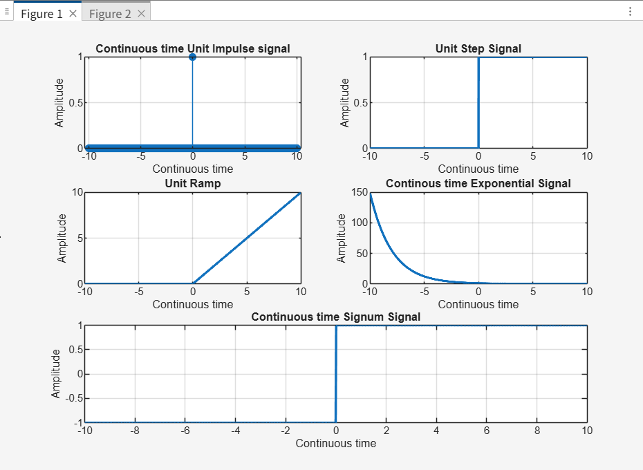

# Continuous-Time Signal Generation in MATLAB

This repository contains MATLAB code to generate and visualize several **fundamental continuous-time signals**.  
The goal of this project is to understand the mathematical definitions of continuous signals and how to represent them visually, which is essential for **signal processing, communication systems, and control engineering**.

---

## 📌 Signals Implemented

The `continuous_signals.m` script generates the following signals:



1. **Unit Impulse Signal (δ(t))**  
   - A theoretical signal that is 0 everywhere except at `t = 0`, where it is undefined but integrates to 1.  
   - Approximated in MATLAB for visualization.  

2. **Unit Step Signal (u(t))**  
   - Defined as `u(t) = 0` for `t < 0`, and `u(t) = 1` for `t ≥ 0`.  

3. **Unit Ramp Signal (r(t))**  
   - Defined as `r(t) = 0` for `t < 0`, and `r(t) = t` for `t ≥ 0`.  

4. **Exponential Signal (e^{at})**  
   - General form:  
     \[
     x(t) = e^{a t}
     \]  
   - The code provides both **decaying (`a < 0`)** and **growing (`a > 0`)** exponentials.  

5. **Sinusoidal Signal (sin(ωt), cos(ωt))**  
   - Defined as `sin(2πft)` or `cos(2πft)` for frequency `f`.  


6. **Sinc Signal**

Defined as:

`sinc(t) = sin(πt) / (πt)` 

---

## 📊 Simulation Results

The script generates plots of all six continuous-time signals, organized in a **3×2 grid** for easy comparison.  

*(Sample plots will appear here once the script is executed.)*  

---

## 🚀 How to Run the Code

1. **Clone the Repository**
   ```bash
   git clone https://github.com/your-username/week2-signals-matlab.git
